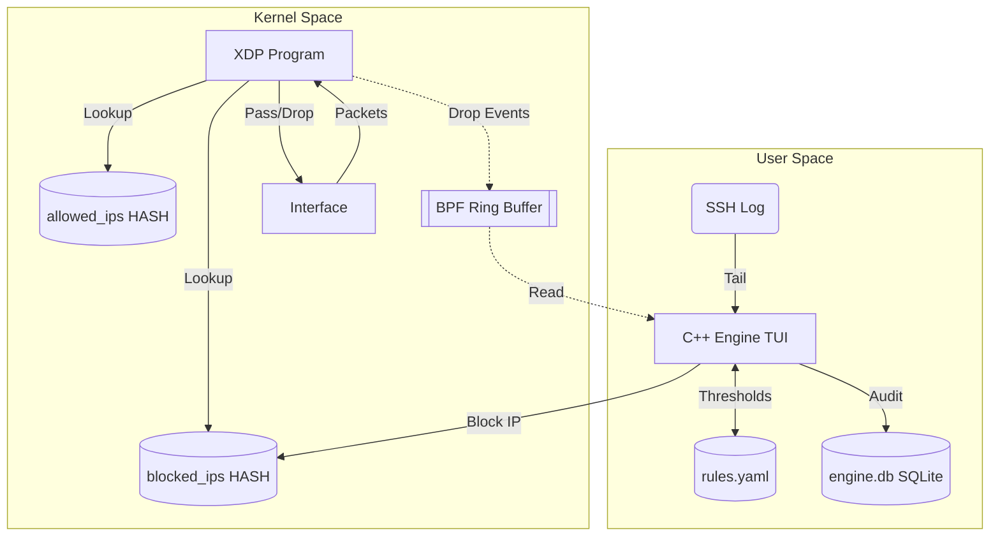

# XDP Intrusion Mitigation Engine

**Review 2 milestone: kernel enforcement, automated detection, live TUI dashboard.**

## What it does
- **Kernel-space Enforcement:** Drops packets at the network interface driver level via eBPF/XDP.
- **Automated Detection:** Detects failed SSH login attempts by tailing the real SSH log.
- **Rule Evaluation:** A C++20 daemon evaluates logs against thresholds (`rules.yaml`).
- **Dynamic Blocking:** Offending IPs are added to an eBPF blocklist map.
- **Audit Logging:** Logs events and alerts to an SQLite database (`engine.db`).
- **Live Dashboard:** A real-time TUI dashboard monitors failures, blocklists, and drop counters.

**Not included in this milestone:** Web dashboard, playbooks, control socket, rate limiter, port-scan or HTTP detection, systemd packaging.

## Why it matters
Dropping a packet early via XDP uses significantly less CPU than traditional firewalls (iptables/Netfilter), allowing the server to withstand massive denial-of-service floods while remaining responsive.

## Installation

1. Install Dependencies:
   - **Fedora:** `sudo dnf install clang llvm libbpf-devel elfutils-libelf-devel zlib-devel yaml-cpp-devel sqlite-devel nlohmann-json-devel gcc-c++ make`
   - **Ubuntu:** `sudo apt install clang libbpf-dev libelf-dev zlib1g-dev libyaml-cpp-dev libsqlite3-dev nlohmann-json3-dev g++ make`
2. Build and Install:
   ```bash
   make clean && make
   sudo make install
   ```

## Quick Start
1. **Preflight Check:**
   ```bash
   xdpguard doctor
   ```
2. **Start the Engine:**
   ```bash
   sudo xdpguard run <iface>
   ```
3. **Simulate an Attack:** See the [Real Attacker Mode](docs/REAL_ATTACKER.md) guide.
4. **View Reports & Cleanup:**
   ```bash
   xdpguard report
   sudo xdpguard cleanup <iface>
   ```

## Live Dashboard

When running `xdpguard run <iface>`, you will see a real-time TUI (Terminal User Interface):

```text
=== XDP INTRUSION ENGINE DASHBOARD ===
Mode: LIVE

--- Counters ---
Passed: 450 | Dropped: 125

--- Live Auth Failures (Last 10) ---
IP: 10.10.0.2 [3 fails]
IP: 192.168.1.15 [1 fails]

--- Blocked IPs ---
10.10.0.2 drops=125 expires=45s

--- Event Stream (Last 12) ---
[EVENT] ssh_failed from 10.10.0.2
[EVENT] ssh_failed from 10.10.0.2
[ALERT] brute_force on 10.10.0.2
[BLOCKED] 10.10.0.2
[EVENT] packet_dropped from 10.10.0.2

Hotkeys: [b]lock, [u]nblock, [a]llow, [d]ry-run toggle, [q]uit
```

## Architecture



Author: Vishad Dubey (GitHub: @v1shad)
