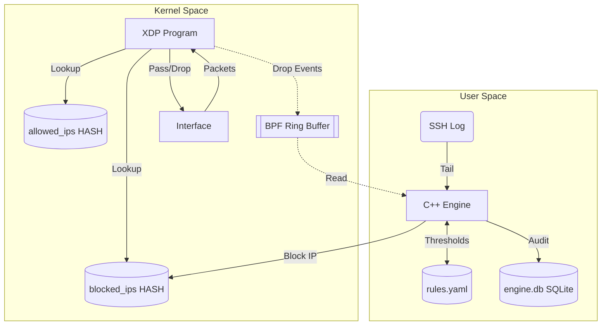

# XDP Intrusion Mitigation Engine

> **A blazing-fast, kernel-level network firewall driven by eBPF/XDP and C++20.**

**Status:** Review 2 milestone

## What it does
* **Kernel-space Enforcement:** Drops packets at the network interface driver level via eBPF/XDP.
* **Automated Detection:** Detects failed SSH login attempts by tailing real SSH logs.
* **Rule Evaluation:** A C++20 daemon evaluates logs against dynamic thresholds.
* **Dynamic Blocking:** Offending IPs are immediately added to an eBPF blocklist map.
* **Audit Logging:** Logs events and alerts to an SQLite database.
* **Live Event Log:** A clean, professional `stdout` event log showing real-time detection, blocks, and drop rates.

**What is NOT included in this milestone:** Web dashboard, playbooks, control socket, rate limiter, port-scan detection, HTTP detection, or systemd packaging.

## Architecture



| Component | Description |
|-----------|-------------|
| **XDP Program** | `xdp_prog.bpf.c`: Kernel-level eBPF code that filters incoming packets. |
| **C++ Engine** | `engine.cpp`: User-space daemon that coordinates everything. |
| **Tailer** | Reads `/var/log/secure` to spot brute-force attempts. |
| **Rule Engine** | Checks active sliding windows for threshold violations. |
| **Storage** | Persists audit history to `engine.db`. |

## Requirements and Setup

**1. Install Dependencies**
* **Fedora:** `[sudo] dnf install clang llvm libbpf-devel elfutils-libelf-devel zlib-devel yaml-cpp-devel sqlite-devel nlohmann-json-devel gcc-c++ make`
* **Ubuntu:** `[sudo] apt install clang libbpf-dev libelf-dev zlib1g-dev libyaml-cpp-dev libsqlite3-dev nlohmann-json3-dev g++ make`

**2. Ensure Logging Services are Running**
You must have `sshd` and `rsyslog` running so that `/var/log/secure` or `/var/log/auth.log` is properly populated.
```bash
[sudo] systemctl enable --now sshd
[sudo] systemctl enable --now rsyslog
```
Ensure your `/etc/ssh/sshd_config` has `PasswordAuthentication yes` explicitly enabled so failures actually register.

**3. Build the Engine**
```bash
make clean && make
```

## Setup the Two Machines

This demo requires two machines on the **same local network**:
1. **Target:** Your laptop, running the engine. Find your IP and interface using `ip addr` (e.g., `wlp8s0` with IP `192.168.1.100`).
2. **Attacker:** Your friend's laptop. They only need your IP address and standard network tools (ping, ssh, nmap).

## Start the Engine

There is only one start command. The engine automatically runs preflight checks on startup.
```bash
[MY LAPTOP] sudo ./engine wlp8s0
```

*Sample Output:*
```text
PASS: Running as root
PASS: Kernel 6.11.0
PASS: BTF file found
PASS: Interface wlp8s0 exists
PASS: sshd is running
PASS: rsyslogd is running
PASS: /var/log/secure readable
PASS: PasswordAuthentication yes
PASS: No existing XDP program attached to wlp8s0
=== ENGINE STARTUP BANNER ===
Interface: wlp8s0
XDP Mode:  Auto
Log Path:  /var/log/secure
TTL:       60s
Threshold: 5
Window:    60s
Allowed:   127.0.0.1 192.168.1.100 192.168.1.1 
=============================
2026-10-07T12:00:00Z [INFO]      Engine started
```

## Walkthrough Demo Steps

**1. Baseline Connectivity**
* [FRIEND LAPTOP] `ping -c 3 <TARGET_IP>`
* [FRIEND LAPTOP] `curl -I http://<TARGET_IP>`
* *Proves:* The friend can successfully reach your laptop.

**2. Automatic Blocking via SSH Guessing**
* [FRIEND LAPTOP] `ssh nosuchuser@<TARGET_IP>` (Type wrong passwords repeatedly)
* [MY LAPTOP] You will see `[AUTH]` warnings tracking the `(n/threshold)` progress. Once it crosses 5, a red `[BLOCKED]` log appears.
* *Proves:* The C++ tailer correctly identified the threat and updated the kernel eBPF map.

**3. The Iron Wall (All traffic dies)**
* [FRIEND LAPTOP] `ping -c 3 <TARGET_IP>` or `nmap -Pn -p 22,80 <TARGET_IP>`
* *Proves:* The attacker's connection will completely freeze. XDP drops *all* protocols for that IP at the driver level.

**4. Proof of Kernel Drops**
* [MY LAPTOP] Run `sudo tcpdump -ni wlp8s0 host <FRIEND_IP>` in a new terminal. 
* [FRIEND LAPTOP] `ping <TARGET_IP>`
* *Proves:* The tcpdump will be completely silent! The packets are dropped by XDP before `tcpdump` even sees them.
* [MY LAPTOP] Verify the eBPF map: `sudo bpftool map dump name blocked_ips`

**5. Ping Flood Under Block**
* [FRIEND LAPTOP] `sudo ping -f <TARGET_IP>` (Run for 5 seconds, then stop).
* [MY LAPTOP] You will see `[DROPPING]` tags in the event log showing the exact drop rate (e.g. `rate=4000/s`).
* *Proves:* The kernel Ring Buffer efficiently reports high-volume line-rate drops to user space.

**6. Recovery**
* [MY LAPTOP] Wait for 60 seconds. The engine will print `[EXPIRED]` and remove the IP.
* [FRIEND LAPTOP] `ping -c 3 <TARGET_IP>` (It succeeds again).

**7. Manual Commands and Allowlist**
* [MY LAPTOP] Type `block <FRIEND_IP>` in the engine console.
* [MY LAPTOP] Type `allow <FRIEND_IP>` to permanently whitelist them, ensuring they can never be blocked again.

**8. Audit Trail**
* [MY LAPTOP] Exit the engine (type `quit`). Run `sqlite3 engine.db "SELECT * FROM alerts;"`
* *Proves:* All actions were permanently recorded.

## Not Detected in This Milestone

| Attack Type | Detected? | Why it misses |
|---|---|---|
| SSH Guessing | **Yes** | Engine detects "Failed password" in logs, blocks IP in XDP. |
| Port Scans (Nmap) | No | XDP doesn't track state, and we have no log tailer for port scans in this milestone. |
| SYN Floods | No | No kernel SYN rate limiter is active yet. |
| Web Attacks | No | HTTP logs are not tailed in Review 2. |

**How to Explain a Miss:** If your friend runs a port scan and asks why they weren't blocked, plainly explain that Review 2 relies purely on SSH log detection. XDP drops packets *after* the user-space daemon makes a block decision based on those logs. Future milestones will introduce raw packet inspection for scans.

## Rules to Agree With Your Friend

1. **Own Network Only:** Ensure both of you are connected to your personal home Wi-Fi or mobile hotspot.
2. **Only My Laptop:** They must strictly target the IP address you provide them.
3. **Time Limit:** Agree on a maximum time limit for the attacks (e.g., 5-10 minutes).
4. **Short Floods:** Cap volumetric attacks (ping floods) at 5 seconds to avoid crashing the local router.
5. **Stop on Request:** They must immediately halt all tools if you say "stop."

## Troubleshooting

| Problem | Solution |
|---|---|
| Friend cannot ping baseline | Client Isolation / Firewalld: Check router AP Isolation, or `[sudo] firewall-cmd --add-service=ssh` |
| Connection refused | `[sudo] systemctl start sshd` |
| No log lines appear | Ensure `PasswordAuthentication yes` in `/etc/ssh/sshd_config`. |
| DHCP changed IP | Find new IP (`ip addr`), update friend. |
| Locked out | Wait 60s for TTL, or type `quit` to exit engine. |
| Error attaching XDP | Run `[sudo] ip link set dev <iface> xdp off` to clear lingering links. |

## Limitations & Disclaimer

* **IPv4 Only:** IPv6 is not supported in this milestone.
* **Tested on Fedora Linux.**
* **Wi-Fi XDP:** generic XDP on Wi-Fi limits performance. No 10Gbps benchmark claims apply here.
* **No Persistence:** Blocklists clear across restarts.
* **Benchmarks:** Benchmarking (`bench.sh`) only runs against virtual `veth` interfaces.

**AI Disclosure:** Parts of this software were written with the assistance of an AI coding assistant.
**License:** See `LICENSE`.
