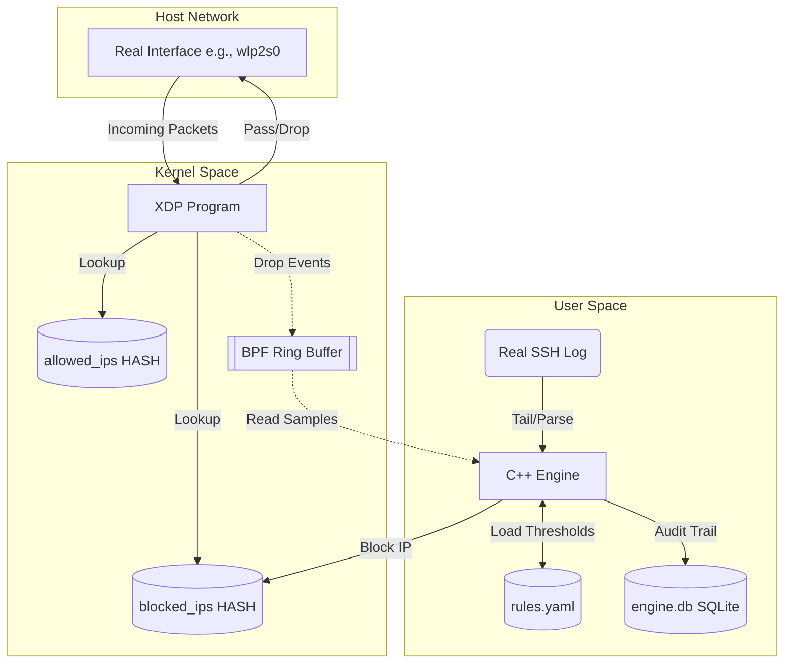

# Tier 3 Automated Intrusion Mitigation Engine

[](https://github.com/v1shad/xdp-intrusion-mitigation-engine-review2/actions/workflows/build.yml)

An eBPF/XDP kernel space and C++20 user space intrusion mitigation engine.

**Review 2 milestone: kernel enforcement, automated detection, audit trail.**

## What it does
- **Kernel-space Enforcement:** Drops packets directly at the network interface driver level via eBPF/XDP on a real interface.
- **Automated Detection:** Dynamically detects failed SSH login attempts by tailing the real `/var/log/secure` or `/var/log/auth.log`.
- **Rule Evaluation:** A C++20 daemon evaluates traffic patterns against thresholds defined in `rules.yaml`.
- **Dynamic Blocking:** Offending physical IP addresses are automatically added to an eBPF blocklist map for line-rate dropping.
- **Audit Logging:** Logs events, generated alerts, and engine actions into a persistent SQLite database (`engine.db`).

**Not included in this milestone:** Playbooks, dashboard, control socket, rate limiter, HTTP detector, systemd packaging.

## Why it matters
Traditional firewalls (like iptables or Netfilter) process packets *after* the OS has allocated memory and parsed network headers. This late handling consumes CPU resources, making the system vulnerable to volumetric floods. eBPF/XDP (eXpress Data Path) runs directly inside the network driver before the standard networking stack even sees the packet. Dropping a packet early via XDP uses significantly less CPU, allowing the server to withstand massive denial-of-service floods while remaining responsive.

## Architecture



| Component | File | Description |
|---|---|---|
| User Space Daemon | `engine.cpp` | Main C++20 executable handling CLI, threads, and maps. |
| Log Detector | `engine.cpp` | `SshDetector` thread reading logs and firing events. |
| Rule Engine | `rule_engine.cpp` / `rules.yaml` | Tracks sliding windows for event thresholds. |
| Storage | `storage.cpp` | SQLite database for persisting audit trail. |
| XDP Program | `xdp_prog.bpf.c` | eBPF program loaded into the kernel. |
| Shared Layouts | `common.h` | Shared C structs for maps and ring buffer events. |

## How it works
1. The engine compiles `xdp_prog.bpf.c` into an eBPF object.
2. The C++ daemon loads this eBPF program into the kernel and attaches it to the specified network interface.
3. The XDP program intercepts all incoming packets, looking up their source IP in the `allowed_ips` and `blocked_ips` maps.
4. Concurrently, a dedicated thread in the user-space daemon tails the real SSH log (`/var/log/secure` or `/var/log/auth.log`).
5. When a source IP exceeds the failure threshold set in `rules.yaml`, the daemon inserts the IP into the `blocked_ips` map.
6. The XDP program immediately begins dropping packets from that IP at line rate, while the user space logs the action to `engine.db`.

## Supported Platforms
- Tested on **Fedora**.
- Expected to work on **Ubuntu 24.04** and other Linux distributions with kernel 5.15+, BTF, and libbpf 1.x (not explicitly tested).
- **Not supported** on native Windows or macOS. eBPF and XDP are strictly Linux kernel features.

## Requirements and Install

### Clone Repository
```bash
git clone https://github.com/v1shad/xdp-intrusion-mitigation-engine-review2.git
cd xdp-intrusion-mitigation-engine-review2
```

### Fedora
```bash
sudo dnf install -y clang llvm libbpf-devel elfutils-libelf-devel zlib-devel yaml-cpp-devel sqlite-devel nlohmann-json-devel gcc-c++ make
```

### Ubuntu
```bash
sudo apt-get update
sudo apt-get install -y clang libbpf-dev libelf-dev zlib1g-dev libyaml-cpp-dev libsqlite3-dev nlohmann-json3-dev g++ make
```

### Kernel Checks
Verify your kernel supports BTF and eBPF:
```bash
uname -r
ls /sys/kernel/btf/vmlinux
```

## Build
```bash
make clean
make
```

## Quick Start
1. **Verify your environment:**
   ```bash
   sudo ./real_check.sh
   ```
2. **Start the engine on your real interface (e.g., wlp2s0):**
   ```bash
   sudo ./real_run.sh wlp2s0
   ```
3. **Simulate an attack:** Have a friend (with consent) SSH into your machine with a wrong password multiple times.
4. **Observe the block:** You will see an alert and block action printed in the engine console, and their IP will be blocked.

## Usage

### Console Commands
| Command | Description |
|---|---|
| `allow <ip>` | Adds an IP to the allowlist (bypasses drops). |
| `unallow <ip>` | Removes an IP from the allowlist. |
| `block <ip>` | Manually adds an IP to the blocklist. |
| `unblock <ip>` | Removes an IP from the blocklist. |
| `list` | Lists currently blocked IPs and expiration times. |
| `stats` | Shows global packets dropped/passed counters. |
| `alerts` | Prints the 10 most recent alerts from the database. |
| `quit` | Detaches the XDP program and cleanly shuts down. |

### Configuration (`rules.yaml`)
Example rule:
```yaml
- name: SSH_BRUTE_FORCE
  match_type: ssh_failed
  threshold: 5
  window_seconds: 60
  severity: high
  mitre: T1110
  action: block
  block_seconds: 600
```

### SQLite Audit
You can query the audit database directly:
```bash
sqlite3 engine.db "SELECT * FROM actions;"
```

## Verifying Kernel Drops
Because XDP drops packets before they reach the OS stack, they are invisible to standard packet captures.
- **tcpdump silence:** `sudo tcpdump -i veth-host -n` will show nothing for the blocked IP.
- **bpftool query:** `sudo bpftool map dump name blocked_ips` shows the raw kernel map state.

## Benchmarks
Results can be viewed in `bench_results.txt` (if present) or generated by running `sudo ./bench.sh`. 
*Note: Measured on a `veth` virtual interface. XDP and iptables-raw were equivalent within noise in this virtualized environment. Real NIC results were not measured.*

## Security Design & Known Limitations
- IPv4 only (no VLAN or IPv6 support).
- No restart persistence (the engine starts with empty maps and a stale blocklist if not cleaned).
- Tested on virtual `veth` interfaces only.
- Invalid-UTF-8 crashing and log-rotation blindness are intentional omissions in this milestone.

## Troubleshooting

| Problem | Solution |
|---|---|
| `/var/log/secure` missing | Ensure `rsyslog` is installed and running, or use `/var/log/auth.log`. |
| Interface down | Run `sudo ip link set dev <interface> up`. |
| IP still blocked | Wait for the TTL to expire or use `unblock <ip>`. |
| Database errors | Clear `engine.db` to let the engine start fresh. |

## Project Layout
- `engine.cpp` - User space daemon.
- `xdp_prog.bpf.c` - eBPF kernel program.
- `rule_engine.cpp` / `rule_engine.h` - Evaluates logs against rules.
- `storage.cpp` / `storage.h` - SQLite audit trail.
- `common.h` / `event.h` - Shared structures.
- `rules.yaml` - Detection thresholds.
- `Makefile` - Build instructions.
- `setup_lab.sh` / `teardown_lab.sh` / `review2_reset.sh` - Virtual lab management.
- `demo_attack.sh` - Injects failed ssh logs.
- `bench.sh` - Benchmark script.

## Safety Notice
**Only attach this engine to the lab interface `veth-host`.** Do not run on your main interface or networks you do not own.

## Roadmap
*Planned, not built in this repo:*
- Playbook automated responses.
- Distributed event correlation.
- Web dashboard.

## Disclosures
Code in this repository was written with the assistance of AI coding assistants.
Released under the MIT License. Author: Vishad Dubey (GitHub: @v1shad)
