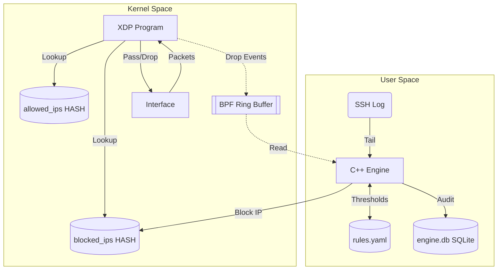

# XDP Intrusion Mitigation Engine

**Review 2 milestone: kernel enforcement, automated detection, professional event logging.**

## What it does
- **Kernel-space Enforcement:** Drops packets at the network interface driver level via eBPF/XDP.
- **Automated Detection:** Detects failed SSH login attempts by tailing the real SSH log.
- **Rule Evaluation:** A C++20 daemon evaluates logs against thresholds (`rules.yaml`).
- **Dynamic Blocking:** Offending IPs are added to an eBPF blocklist map.
- **Audit Logging:** Logs events and alerts to an SQLite database (`engine.db`).
- **Live Event Log:** A clean, professional `stdout` event log showing real-time detection, blocks, and drop rates.

**Not included in this milestone:** Web dashboard, playbooks, control socket, rate limiter, port-scan or HTTP detection, systemd packaging.

## Why it matters
Dropping a packet early via XDP uses significantly less CPU than traditional firewalls (iptables/Netfilter), allowing the server to withstand massive denial-of-service floods while remaining responsive.

## Installation

1. Install Dependencies:
   - **Fedora:** `sudo dnf install clang llvm libbpf-devel elfutils-libelf-devel zlib-devel yaml-cpp-devel sqlite-devel nlohmann-json-devel gcc-c++ make`
   - **Ubuntu:** `sudo apt install clang libbpf-dev libelf-dev zlib1g-dev libyaml-cpp-dev libsqlite3-dev nlohmann-json3-dev g++ make`
2. Build and Install:
   ```bash
   make clean && make
   sudo make install
   ```

## Quick Start
1. **Preflight Check:**
   ```bash
   xdpguard doctor
   ```
2. **Start the Engine:**
   ```bash
   sudo xdpguard run <iface> --enforce
   ```
3. **Simulate an Attack:** See the [Real Attacker Mode](docs/REAL_DEMO.md) guide.
4. **View Reports & Cleanup:**
   ```bash
   xdpguard report
   sudo xdpguard cleanup <iface>
   ```

## Live Output Sample
```text
2026-10-06T12:00:00Z [INFO]     Engine started
2026-10-06T12:00:15Z [AUTH]     SSH failure from 10.0.0.5 (4/5)
2026-10-06T12:00:17Z [AUTH]     SSH failure from 10.0.0.5 (5/5)
2026-10-06T12:00:17Z [BLOCKED]  10.0.0.5 ttl=60s
2026-10-06T12:00:20Z [DROPPING] 10.0.0.5 total=25 rate=8/s
2026-10-06T12:01:17Z [EXPIRED]  10.0.0.5 (ttl elapsed)
```

## Architecture

